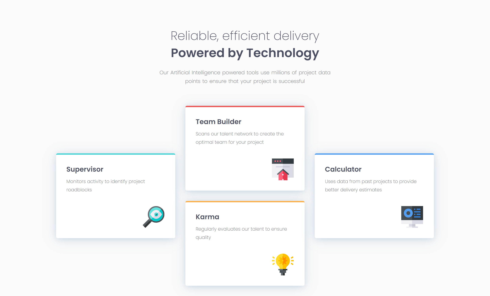
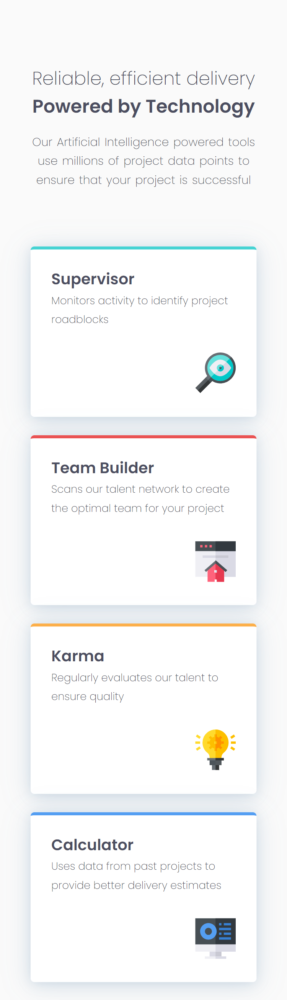

# Frontend Mentor - Four card feature section solution

Esta é uma solução para o [Four card feature section challenge on Frontend Mentor](https://www.frontendmentor.io/challenges/four-card-feature-section-weK1eFYK). Os desafios do Frontend Mentor ajudam você a melhorar suas habilidades de codificação através da construção de projetos realistas. 

## Índice

- [Visão geral](#visão-geral)
  - [Screenshot](#screenshot)
  - [Links](#links)
- [Meu processo](#meu-processo)
  - [Construído com](#construído-com)
  - [O que eu aprendi](#o-que-eu-aprendi)
  - [Desenvolvimento contínuo](#desenvolvimento-contínuo)
- [Autor](#autor)

## Visão geral

### Screenshot

Desktop

Mobile

### Links

- Live Site URL: [Four card feature section]()

## Meu processo

### Construído com

- Semantic HTML5 markup
- CSS custom properties
- Flexbox
- CSS Grid
- Mobile-first

### O que eu aprendi

Neste projeto eu usei flex, grid e fiz duas @media(min-width) para aumentar a responsividade e melhorar a visualização em diferentes tamanhos de tela.

### Desenvolvimento contínuo

Planejo continuar focando em projetos de HTML e CSS para praticar e fixar o que aprendi sobre essas linguagens

## Autor

- Frontend Mentor - [@Isabela-Fernanda](https://www.frontendmentor.io/profile/Isabela-Fernanda)